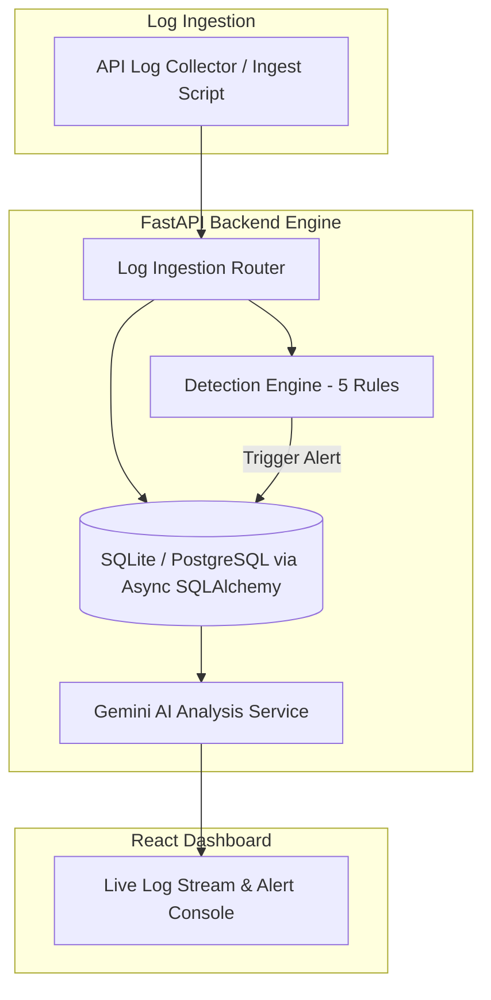

# 🛡️ SIEM AI Guardian

**Enterprise SIEM Platform with Multi-Rule Detection Engine & LLM Incident Analysis**

[](https://www.python.org/)
[](https://fastapi.tiangolo.com/)
[](https://react.dev/)
[](https://www.sqlalchemy.org/)
[](LICENSE)

**SIEM AI Guardian** is a full-stack Security Information and Event Management (SIEM) platform. It combines high-throughput log ingestion, a 5-rule MITRE ATT&CK threat detection engine, and Google Gemini AI incident analysis.

---

## 📌 Architecture Pipeline



---

## 🛡️ Detection Engine & MITRE ATT&CK Rules

| Rule Name | Trigger Threshold | Severity | MITRE Tactic / Technique |
|---|---|:---:|---|
| **Brute Force Detection** | `>= 5` failed logins within 60s from same IP | HIGH | Credential Access / T1110 |
| **Port Scan Detection** | `>= 10` distinct ports probed within 30s | MEDIUM | Discovery / T1046 |
| **Threat Intel Match** | Source IP matches known malicious IP blacklist | HIGH | Command and Control / T1071 |
| **After-Hours Login** | Successful authentication between 22:00–06:00 UTC | LOW | Defense Evasion / T1078 |
| **Privilege Escalation** | `sudo` or `su root` execution keywords in log message | CRITICAL | Privilege Escalation / T1068 |

---

## 🚀 Quickstart

### Prerequisites
- Python 3.10+
- Node.js 18+
- Optional: Gemini API key for AI incident analysis ([Get free key](https://aistudio.google.com/app/apikey))

### 1. Backend Setup

```bash
# Navigate to backend directory
cd backend

# Create virtual environment
python -m venv venv
# On Windows:
.\venv\Scripts\Activate.ps1
# On Linux/macOS:
source venv/bin/activate

# Install dependencies
pip install -r requirements.txt

# Configure environment variables
cp .env.example .env
# Edit .env and set GEMINI_API_KEY=your_api_key

# Run FastAPI backend server
uvicorn app.main:app --reload --port 8000
```
*API interactive documentation available at `http://localhost:8000/docs`.*

### 2. Frontend Setup

```bash
# Navigate to frontend directory
cd frontend

# Install dependencies & launch Vite dev server
npm install
npm run dev
```
*Access Web Security Dashboard at `http://localhost:5173`.*

### 3. Seed Test Security Data

```powershell
# Run PowerShell test seed script (requires backend running)
.\scripts\seed_test_data.ps1
```

Generates synthetic telemetry triggering brute force attacks, port scans, privilege escalations, and normal baseline events.

---

## 🌐 API Reference

### Log Ingestion & Querying
- `POST /api/logs/ingest`: Ingests a single JSON log event.
- `POST /api/logs/ingest/bulk`: Bulk ingest up to 1,000 log events.
- `GET /api/logs`: Filterable log stream query endpoint.

### Alert Management & AI Analysis
- `GET /api/alerts`: List active security alerts.
- `GET /api/alerts/{id}`: Detailed alert metadata and correlated events.
- `PATCH /api/alerts/{id}`: Update alert triage status (`open`, `investigating`, `resolved`, `false_positive`).
- `POST /api/alerts/{id}/analyze`: Triggers automated Gemini AI incident analysis & remediation advice.

---

## 📁 Repository Structure

```
siem-ai-guardian/
├── backend/
│   ├── main.py                   # App entrypoint
│   ├── requirements.txt
│   └── app/
│       ├── api/                  # Log ingestion, alerts, and AI endpoints
│       ├── core/                 # App configuration & async DB connection
│       ├── models/               # SQLAlchemy DB models (LogEntry, Alert)
│       └── services/             # Detection engine & Gemini AI service
├── frontend/
│   ├── src/                      # React UI, hooks, and security components
│   ├── package.json
│   └── vite.config.js
├── scripts/
│   └── seed_test_data.ps1        # Test log generator script
└── README.md
```

---

## 📜 License

This project is licensed under the MIT License - see the [LICENSE](LICENSE) file for details.
